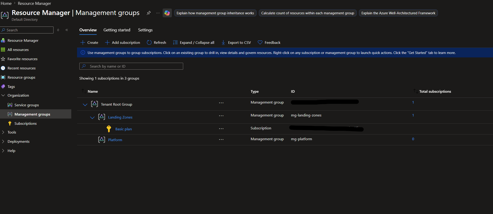
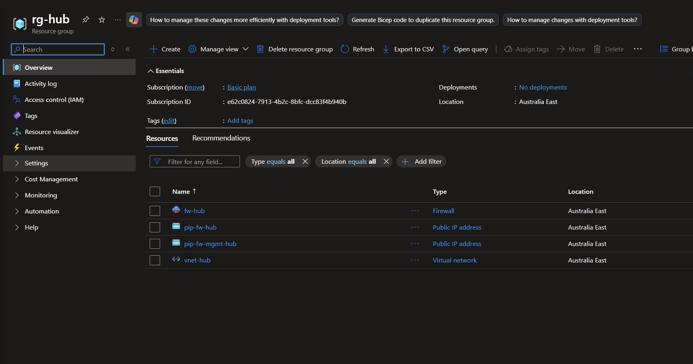
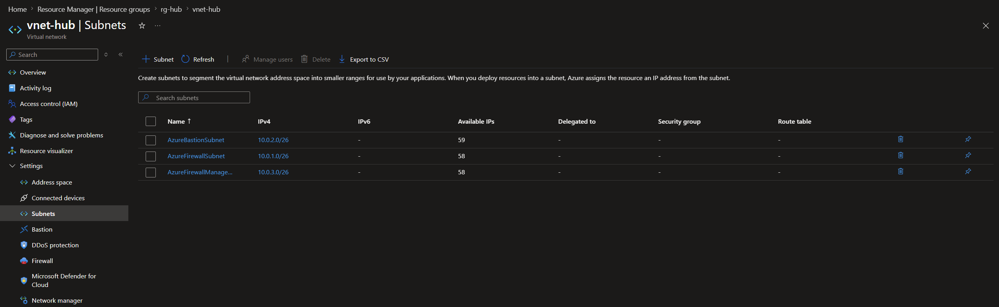
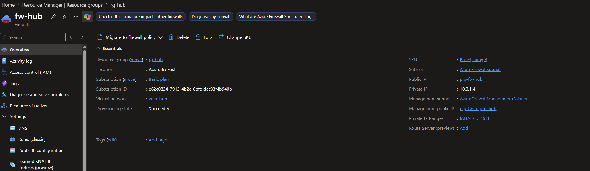

# Deployment & Validation Guide

This document details the deployment process, validation steps, and visual proofs for the Azure Landing Zone infrastructure provisioned via Terraform.

---

## 1. Environment & Prerequisites

The following tools and configurations were configured prior to deployment:

* **Azure CLI:** Installed and authenticated using `az login`.
* **Terraform CLI:** Installed (v1.x+).
* **Permissions:** Owner/Contributor access at the Subscription level and Management Group scope.

---

## 2. Execution Workflow

The deployment was executed in phases using HashiCorp Terraform:

### Step 1: Initialize Working Directory
Initialized the backend and downloaded the required AzureRM provider plugins:

```bash
cd terraform/
terraform init
```

### Step 2: Execution Plan
Generated and inspected the execution plan to confirm resource specs:

```bash
terraform plan -out=tfplan
```

### Step 3: Infrastructure Provisioning
Applied the targeted configuration to create the Landing Zone hierarchy, virtual networks, subnets, and Azure Firewall:

```bash
terraform apply tfplan
```

---

## 3. Deployment Proof & Verification

Visual confirmation of deployed resources from the Azure Portal:

### Management Group Hierarchy
Verified the structural alignment under the Tenant Root Group, segregating **Platform** and **Landing Zones**.



---

### Hub Resource Group Overview
Verified the creation of the central `rg-hub` resource group hosting the Azure Firewall, Public IP addresses, and Virtual Network resources in Australia East.



---

### Hub & Spoke Virtual Networks
Verified the **Hub VNet** (`10.0.0.0/16`) subnet configurations (`AzureFirewallSubnet`, `AzureBastionSubnet`) supporting centralized security and connectivity.



---

### Spoke Virtual Network Subnets
Verified the subnet configuration inside **`vnet-spoke`**, confirming the creation of the dedicated workload subnet (**`snet-workload`** - `10.1.0.0/24`) for application deployment.


---

### Centralized Azure Firewall
Verified that the Azure Firewall (Basic SKU) instance was initialized inside `AzureFirewallSubnet` for centralized security inspection.



---

## 4. Resource Teardown

To manage cloud usage efficiently, all billable components were safely destroyed after testing and documentation:

```bash
terraform destroy
```

*Note: `terraform destroy` cleanly tore down the firewall, peered networks, subnets, and management group associations.*
